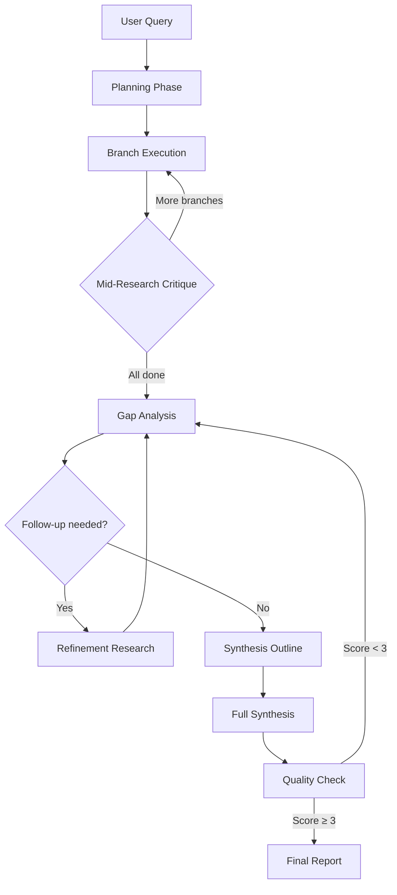

# Deep Research Pipeline

This document describes the Deep Research mode — Katab's most sophisticated feature. It is a meta-mode that transforms the standard tool-calling loop into an exhaustive multi-phase research pipeline.

---

## Table of Contents

- [Overview](#overview)
- [Pipeline Phases](#pipeline-phases)
- [Architecture](#architecture)
- [Compression Pipeline](#compression-pipeline)
- [Thresholds & Constants](#thresholds--constants)
- [How It Differs from Regular Tool-Calling](#how-it-differs-from-regular-tool-calling)
- [Performance Considerations](#performance-considerations)

---

## Overview

Deep Research raises tool-call iteration limits and context thresholds, then runs a structured pipeline: planning → branch execution → gap analysis → refinement → synthesis → quality check. It is activated via the `/research` command, the Research footer button (set to On), or the `deep_research` tool when autonomous mode detects exhaustive research needs.

**File locations:**
- Core orchestration: `extension.js` (methods prefixed `_run*`, `_build*` for research phases)
- Compression: `src/research/compressionTools.js`
- Citation tracking: `src/research/citationTracker.js`
- Result caching: `src/research/researchCache.js`
- Tool definition: `src/tools/toolDefinitions.js` (`deep_research` tool)

---

## Pipeline Phases

### Phase 1: Planning

The user's query is sent to the LLM with a planning prompt that asks it to break the question into 3–5 research angles. Each angle includes:
- A short description of the angle
- SEO-optimized search queries

The plan is shown to the user for approval before execution begins. If the planner fails (e.g., timeout), a fallback plan with the original query as a single angle is used.

While a plan is pending approval, a follow-up prompt is treated as a **plan revision**, not a new research query: the revision planner (`_reviseResearchPlan`) is called with the original query, the current plan, and the user's feedback, and returns an updated plan that applies only the requested changes (dates, versions, scope, angles) while preserving the rest. The pending plan is only replaced if the revision succeeds; on failure the existing plan is left untouched. An explicit `/research` command still starts a fresh plan. Plan revisions do not consume the Deep Research turn (so a one-shot `/research` keeps deep thresholds through the eventual execution), and the phase routes correctly even if the mode was toggled off. The plan card offers **Edit plan**, **Cancel plan** (which exits the phase and turns Deep Research back off), and **Start research**.

**Key methods**: `_runPlannerAgent(query)` — makes a non-streaming completion call with `_requestNonStreamingCompletion` for initial plan generation; `_reviseResearchPlan(originalQuery, currentPlan, feedback)` — same call shape with the revision system prompt. Provider timeout is set appropriately (unbounded for Ollama local models).

### Phase 2: Branch Execution

Each angle runs as a sequential branch:
1. **Search**: Queries SearxNG with the angle's search terms.
2. **Read**: Fetches the top search results via `read_url`.
3. **Crawl**: Deep-scrapes the most promising pages via Crawl4AI.
4. **Compress**: Compresses findings using Level 1 and Level 2 compression.

Results from each branch are added to `_globalResearchContext` — a shared context that subsequent branches can reference. A condensed summary of each completed branch is pushed so later branches have cross-topic awareness.

**Key method**: `_executeResearchBranches(angles)` — orchestrates branch execution and progress tracking.

### Phase 3: Mid-Research Critique

After every N branches, a lightweight LLM call evaluates:
- What's been covered so far
- What angles remain
- Whether any angles should be adjusted or replaced

This prevents the pipeline from wasting iterations on redundant angles.

**Key method**: `_runMidResearchCritique()`.

### Phase 4: Gap Analysis

A focused LLM review identifies gaps in coverage relative to the user's original question. It generates 0–2 targeted follow-up search queries with rationales.

**Key method**: `_runGapAnalysis()` — uses a dedicated system prompt (`GAP_ANALYSIS_SYSTEM_PROMPT`) and limited token budget (`GAP_ANALYSIS_MAX_TOKENS`).

### Phase 5: Refinement Research

Gap queries are executed as lightweight mini-branches: search → crawl top 2 → compress. Results are appended to the progress card as refinement rows.

**Key method**: `_runRefinementResearch(gapQueries)`.

### Phase 6: Two-Pass Synthesis

**Pass 1 — Outline**: All accumulated findings (branch results + refinement results) are sent to the LLM to generate a structured outline. This outline serves as a scaffolding for the final report.

**Pass 2 — Full Report**: The outline and all findings are sent to the LLM with instructions to write a comprehensive report answering the user's original question. The report is streamed (like a normal response).

The synthesis prompt is **topic-driven**, not branch-driven: it centers the user's original question and treats branch findings as context/information sources only.

**Key methods**:
- `_buildSynthesisOutline(findings)` — non-streaming outline generation
- `_buildSynthesisPrompt(findings, outline)` — constructs the final synthesis prompt with adaptive proportional truncation

### Phase 7: Quality Check

The final report is scored by the LLM (1–5) based on completeness, accuracy, and relevance. If the score is below 3, additional research is triggered (return to gap analysis). This loop has a guard to prevent infinite recursion.

**Key method**: `_runQualityCheck(report)`.

---

## Architecture

### State Management

Deep Research uses several instance variables on `KatabDialog`:

| Variable | Purpose |
|---|---|
| `_globalResearchContext` | Accumulated findings shared across branches |
| `_branchResults` | Array of per-branch compressed results |
| `_refinementResults` | Array of gap-filling refinement results |
| `_gapRationale` | Text explaining what gaps were found |
| `_synthesisOutline` | The structured outline from Pass 1 |
| `_originalResearchQuery` | The user's original question (for topic-driven synthesis) |
| `_researchProgressCard` | UI element showing phase progress |

### Progress States

The progress card shows the current phase through CSS classes on the status label:
- `.analyzing` — Planning phase
- `.searching` / `.reading` / `.crawling` — Branch execution
- `.compressing` — Compression step
- `.refining` — Gap-filling refinement
- `.outlining` — Synthesis outline generation
- `.writing` — Full report streaming

### Tool Advertisement

During deep research, the standard tool-calling loop is active but with raised thresholds. The model is given tool schemas and can call `web_search`, `read_url`, and `crawl_url` autonomously. Force synthesis (tool removal) happens at higher thresholds than normal mode.

---

## Compression Pipeline

The compression pipeline transforms raw web content into progressively more concise and structured findings. It is implemented in `src/research/compressionTools.js`.

### Level 1: Per-Page Compression
- **Input**: Raw page content (Markdown from Crawl4AI or text from `read_url`)
- **System prompt**: `COMPRESS_PAGE_SYSTEM`
- **Output**: 3–5 factual claims as `[{claim, url}]` JSON
- **Rules**: Skip marketing fluff, navigation, boilerplate. Focus on statistics, dates, names, events, technical details.

### Level 2: Page Merge
- **Input**: Multiple Level 1 summaries for the same branch
- **System prompt**: `MERGE_PAGE_SYSTEM`
- **Output**: ≤10 deduplicated bullet points
- **Notes**: Multi-source confirmation is noted. Redundant claims are merged.

### Level 3: Thematic Clustering
- **Input**: Multiple Level 2 summaries across branches
- **System prompt**: `CLUSTER_THEMES_SYSTEM`
- **Output**: Paragraphs per theme with multi-source citations

### Level 4: Section Drafting
- **Input**: Thematic clusters
- **System prompt**: `DRAFT_SECTION_SYSTEM`
- **Output**: Coherent prose sections with intro and conclusion

### Raw Fact Preservation

In addition to compressed summaries, the synthesis prompt includes granular `{claim, url}` facts. This prevents information loss from aggressive compression. The synthesis budget is split 60/40: 60% for the merged narrative summary, 40% for granular facts.

---

## Thresholds & Constants

### Force Synthesis Thresholds

| Constant | Normal Mode | Deep Research |
|---|---|---|
| `FORCE_SYNTHESIS_AFTER_ITERATIONS` | 5 | `DEEP_RESEARCH_FORCE_SYNTHESIS_ITERATIONS` (12) |
| `CONTEXT_SYNTHESIS_THRESHOLD_CHARS` | 50,000 | `DEEP_RESEARCH_CONTEXT_THRESHOLD_CHARS` (150,000) |

### Truncation Tiers

Tool results are progressively truncated by iteration count to prevent context overflow:

| Iteration | Search Results | Read URL Chars | Crawl Chars |
|---|---|---|---|
| 1–2 | 10 × 500 chars | 12,000 | 24,000 |
| 3–4 | 8 × 350 chars | 6,000 | 12,000 |
| 5–6 | 5 × 250 chars | 3,000 | 6,000 |
| 7+ | 3 × 150 chars | 1,500 | 3,000 |

Deep Research doubles these limits.

### Synthesis Budget

- **Context budget**: 80,000 characters for synthesis prompt
- **Adaptive truncation**: When total findings exceed budget, truncation is proportional across branches
- **Fact/bullet split**: ~60% for merged narrative, ~40% for raw facts

### Other Constants

| Constant | Value | Purpose |
|---|---|---|
| `GAP_ANALYSIS_MAX_FOLLOWUP_QUERIES` | 2 | Max follow-up queries from gap analysis |
| `GAP_ANALYSIS_MAX_TOKENS` | Model limit | Token budget for gap analysis call |
| `REFINEMENT_CRAWL_COUNT` | 2 | Pages to crawl per refinement query |
| `SYNTHESIS_OUTLINE_MAX_TOKENS` | Model limit | Token budget for outline generation |
| `DEFAULT_MAX_TOKENS_MERGE` | 3,072 | Token budget for Level 2 merge |

---

## How It Differs from Regular Tool-Calling

| Aspect | Regular Tool-Calling | Deep Research |
|---|---|---|
| **Max tool iterations** | 5 | 12 |
| **Synthesis trigger** | 50K chars context | 150K chars context |
| **Planning** | None | 3–5 angles with user approval |
| **Gap analysis** | None | Explicit gap detection + follow-up |
| **Refinement** | None | Targeted mini-branches for gaps |
| **Synthesis** | Single-pass answer | Two-pass (outline + full report) |
| **Quality check** | None | Score 1–5 with retry below 3 |
| **Compression** | None | 4-level hierarchical pipeline |
| **Citations** | Source links only | Inline `[N]` buttons + bibliography |
| **Caching** | None | SHA-256 keyed persistent cache |
| **Progress UI** | Tool-call log rows | Phase progress card |
| **Context sharing** | Per-turn only | Cross-branch `_globalResearchContext` |

---

## Performance Considerations

### Parallel vs. Sequential Execution
- **Branch execution**: Sequential (not parallel) to allow cross-branch context sharing. Each branch benefits from previous branches' findings.
- **Tool execution within a branch**: `read_only` tools execute in parallel via `Promise.all()`. `potentially_unsafe` tools run sequentially with delay.
- **Cache**: Searches and crawls are cached by SHA-256 key, so repeated deep research on similar topics is significantly faster.

### Memory
- `_globalResearchContext` accumulates all branch findings as strings. For very large research tasks, this can grow to 100K+ characters.
- `_branchResults` stores per-branch compressed outputs.
- The research cache at `~/.local/share/katabai/research-cache.json` persists between sessions.

### Time
- Each branch involves 3–5 network calls (search → read → crawl → compression LLM call).
- Planning and gap analysis are each one non-streaming LLM call.
- Synthesis is two LLM calls (outline + full report), with the full report streamed.
- A typical 5-angle deep research takes 2–5 minutes depending on provider speed and page load times.

### Failure Handling
- **Planner failure**: Falls back to original query as single angle.
- **Individual branch failure**: Skipped, other branches continue.
- **Gap analysis failure**: Skipped, proceeds to synthesis without refinement.
- **Quality check failure**: Proceeds with best available report.
- The pipeline is designed to degrade gracefully — partial results are better than no results.
