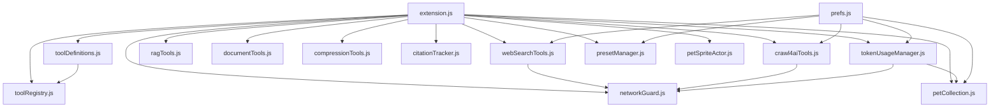
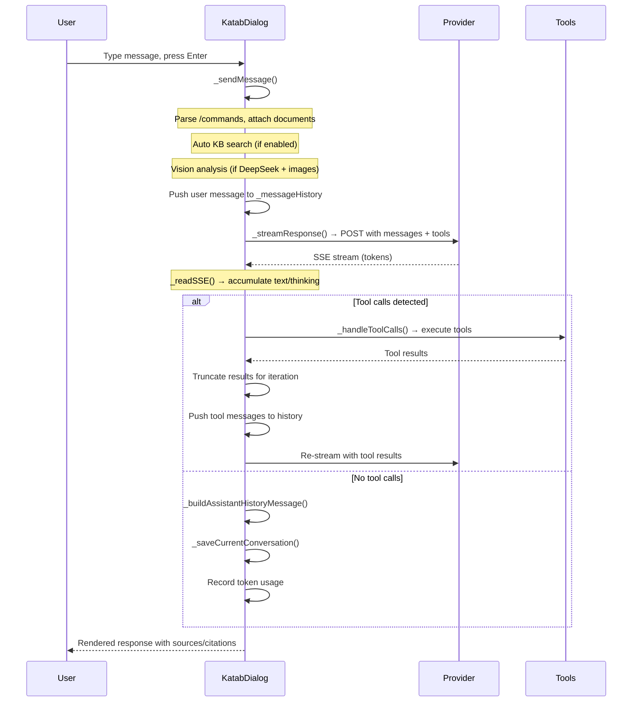

# Katab Development Guide

This document covers setting up a development environment, understanding the project structure, coding conventions, and extending Katab with new features.

---

## Table of Contents

- [Environment Setup](#environment-setup)
- [Project Structure Walkthrough](#project-structure-walkthrough)
- [Coding Conventions](#coding-conventions)
- [Adding a New Provider](#adding-a-new-provider)
- [Adding a New Tool](#adding-a-new-tool)
- [Adding a New Pet](#adding-a-new-pet)
- [Debugging Tips](#debugging-tips)
- [Schema Management](#schema-management)
- [Testing](#testing)

---

## Environment Setup

### Prerequisites
- GNOME Shell 46, 47, or 48
- GJS (GNOME JavaScript, comes with GNOME Shell)
- `glib-compile-schemas` (from `glib2` package)

### Setup Steps

1. **Clone the repository** to your GNOME Shell extensions directory:
   ```bash
   git clone https://github.com/inderdeepk/katabai-cetikaytools.com.git ~/.local/share/gnome-shell/extensions/katabai@cetikaytools.com
   cd ~/.local/share/gnome-shell/extensions/katabai@cetikaytools.com
   ```

2. **Compile GSettings schemas** (required after any schema XML change):
   ```bash
   make compile-schemas
   # or: glib-compile-schemas schemas/
   ```

3. **Enable the extension**:
   ```bash
   gnome-extensions enable katabai@cetikaytools.com
   ```

4. **Reload GNOME Shell after changes**:
   - **X11**: `Alt+F2`, type `r`, press Enter.
   - **Wayland**: Log out and log back in, or:
     ```bash
     gnome-extensions disable katabai@cetikaytools.com
     gnome-extensions enable katabai@cetikaytools.com
     ```

5. **Monitor logs**:
   ```bash
   journalctl -f -o cat /usr/bin/gnome-shell | grep -i katab
   ```

6. **Inspect GSettings**:
   ```bash
   gsettings list-recursively org.gnome.shell.extensions.katabai
   gsettings get org.gnome.shell.extensions.katabai provider
   ```

### Optional Services for Full Testing
| Service | Default Port | Purpose |
|---|---|---|
| Ollama | 11434 | Local LLM inference |
| Unsloth Studio | 8888 | Optimized local AI with tools |
| SearxNG | 8080 | Metasearch engine |
| Crawl4AI | 11235 | Browser-based web scraping |
| Python RAG Service | 11435 | Vector search knowledge base |

---

## Project Structure Walkthrough

```
katabai@cetikaytools.com/
├── extension.js              # Main entry: KatabExtension, KatabDialog, HistoryManager,
│                             #   ProviderHealthMonitor, Indicator
├── prefs.js                  # GTK4/Adwaita preferences window (separate process)
├── prefs.css                 # Preferences CSS (loaded by prefs.js via Gtk.CssProvider)
├── stylesheet.css            # Shell overlay St CSS (auto-loaded by GNOME)
├── metadata.json             # Extension manifest (UUID, versions, schema)
├── Makefile                  # compile-schemas, check, test, package, install, clean
├── schemas/
│   ├── org.gnome.shell.extensions.katabai.gschema.xml  # ~80+ GSettings keys
│   └── gschemas.compiled                              # Compiled binary (gitignored)
├── src/
│   ├── core/                 # Planned refactoring targets (currently empty)
│   ├── tools/
│   │   ├── toolRegistry.js    # Declarative tool registry (ToolDefinition Map)
│   │   ├── toolDefinitions.js # Concrete tool definitions (side-effect import)
│   │   ├── webSearchTools.js  # SearxNG search + read_url page fetch + SSRF guard
│   │   ├── crawl4aiTools.js   # Crawl4AI deep browser scraping + async job polling
│   │   ├── ragTools.js        # Local RAG / knowledge base semantic search
│   │   └── documentTools.js   # Local file parser (txt/md/pdf/docx/png/jpg)
│   ├── research/
│   │   ├── compressionTools.js  # LLM-based hierarchical compression (4 levels)
│   │   ├── citationTracker.js   # Citation → bibliography binding
│   │   └── researchCache.js     # SHA-256 keyed persistent cache
│   ├── usage/
│   │   ├── tokenUsageManager.js # Token ledger, cost, budget, achievements, pets
│   │   └── presetManager.js     # Ollama preset CRUD (27 settings)
│   ├── pets/
│   │   ├── petCollection.js     # Pet definitions, stages, forms, crossbreeds
│   │   └── petSpriteActor.js   # Clutter sprite renderer with animation
│   └── shared/
│       └── networkGuard.js      # IPv4/IPv6 SSRF blocklists
├── tests/
│   ├── petCollection.test.js    # Pet logic unit tests
│   └── tokenUsageManager.test.js # Token usage unit tests
├── icons/                    # Provider logos + custom SVG icons (9 files)
├── sprites/                  # Pet sprite PNGs (5 providers + eggs + accents + mixie)
└── Documentation/            # Help, Technical, Archive, Research Reports
```

### Key Dependencies



### Data Flow (Message Send)



---

## Coding Conventions

### JavaScript (GJS)
- **ES Modules**: Use `import`/`export`. No CommonJS.
- **GObject Classes**: Extend `GObject.Object`, register with `GObject.registerClass()`.
- **Soup v3**: Import with `gi://Soup?version=3.0`. Always include version.
- **Async**: `async`/`await` with `Gio.Cancellable`. Never block the main thread.
- **Error handling**: Wrap `JSON.parse`, API calls, and file I/O in try/catch.
- **Naming**: camelCase for variables/methods, PascalCase for classes, UPPER_SNAKE_CASE for constants.
- **Comments**: JSDoc-style for public APIs. Explain _why_, not _what_.
- **No API keys in source**: All secrets go through GSettings. Never commit keys.

### GSettings Schema
- **Always recompile** after XML edits: `glib-compile-schemas schemas/`
- Key naming: lowercase with hyphens (`deepseek-vision-model`).
- Keybinding keys: type `as` (string array), not `s`.
- Default values must be valid for the key type.

### GNOME Shell St CSS (`stylesheet.css`)
- **No `flex-wrap` or `text-transform`** — not supported by St toolkit.
- **Avoid `border-radius` and `box-shadow`** on large containers — triggers `ClutterOffscreenEffect` which can exceed GPU texture limits on long content.
- Use `rgba()` for transparency, not `opacity`.
- Every chat UI class needs both `.katab-theme-dark` and `.katab-theme-light` variants.

### Clutter UI (`extension.js`)
- **Selectable text**: Set `reactive=true`, `selectable=true`, `cursor_visible=true`, `editable=false`, and wire custom `button-press`/`motion`/`button-release` handlers that return `Clutter.EVENT_STOP`. Never set read-only `ClutterText` as editable — it strips Pango markup.
- **Byte vs. character offsets**: `clutter_text_coords_to_position()` returns UTF-8 byte indices. `set_selection()` expects character offsets. Convert with a `g_utf8_strlen(text, maxbytes)` helper.
- **Key focus**: `widget.grab_key_focus()`, never `global.stage.set_key_focus()`.
- **Clipboard**: `St.Clipboard.get_default().set_text(St.ClipboardType.CLIPBOARD, text)`.

### Asynchronous Pattern
```javascript
async _someAsyncMethod() {
    const cancellable = new Gio.Cancellable();
    try {
        const result = await new Promise((resolve, reject) => {
            this._soupSession.send_and_read_async(
                message,
                Gio.Priority.DEFAULT,
                cancellable,
                (session, result) => {
                    try {
                        const bytes = session.send_and_read_finish(result);
                        resolve(bytes);
                    } catch (e) {
                        reject(e);
                    }
                }
            );
        });
        return result;
    } catch (e) {
        if (!cancellable.is_cancelled()) {
            throw e;
        }
    }
}
```

---

## Adding a New Provider

### Step 1: Add GSettings Keys
In `schemas/org.gnome.shell.extensions.katabai.gschema.xml`, add keys for the new provider:
```xml
<key name="newprovider-url" type="s">
  <default>"https://api.newprovider.com"</default>
  <summary>NewProvider Base URL</summary>
</key>
<key name="newprovider-api-key" type="s">
  <default>""</default>
  <summary>NewProvider API Key</summary>
</key>
<key name="newprovider-model" type="s">
  <default>"default-model"</default>
  <summary>NewProvider Model</summary>
</key>
```
Recompile: `glib-compile-schemas schemas/`

### Step 2: Add Provider Constants
In `extension.js`, add to `PROVIDER_LABELS` and `PROVIDER_META`:
```javascript
const PROVIDER_LABELS = {
    // ... existing providers
    newprovider: 'NewProvider',
};

const PROVIDER_META = {
    // ... existing providers
    newprovider: {
        label: 'NewProvider',
        iconFile: 'newprovider.svg',
        iconClass: 'katab-provider-icon-newprovider',
        color: '#your-color',
    },
};
```
Add the icon file to `icons/`.

### Step 3: Add Payload Builder
In `extension.js::_streamResponse()`, add an `else if (provider === 'newprovider')` block:
```javascript
} else if (provider === 'newprovider') {
    const newproviderUrl = this._settings.get_string('newprovider-url');
    endpoint = newproviderUrl.endsWith('/chat/completions')
        ? newproviderUrl
        : `${newproviderUrl}/chat/completions`;
    payload = {
        model: this._settings.get_string('newprovider-model'),
        messages: apiMessagesWithSystemPolicy,
        stream: true,
    };
    if (advertiseLocalTools) {
        payload.tools = buildToolSchemasFor(toolNames, 'openai');
    }
    headers.Authorization = `Bearer ${this._settings.get_string('newprovider-api-key')}`;
}
```

### Step 4: Add SSE Parser
In `extension.js::_readSSE()`, add provider-specific parsing for the response format.

### Step 5: Add Health Probe
In `extension.js::ProviderHealthMonitor`, add a probe for the new provider's health endpoint.

### Step 6: Add Preferences Page
In `prefs.js`, add a provider page with URL, API key, and model settings using `createProviderPage()`.

### Step 7: Test
```bash
# Test the provider's API directly
curl -X POST https://api.newprovider.com/chat/completions \
  -H "Content-Type: application/json" \
  -H "Authorization: Bearer YOUR_KEY" \
  -d '{"model":"default-model","messages":[{"role":"user","content":"hello"}],"stream":true}'
```

---

## Adding a New Tool

### Step 1: Define the Tool
In `src/tools/toolDefinitions.js`, register the tool:
```javascript
registerTool({
    name: 'my_tool',
    description: 'What this tool does for the model.',
    parameters: {
        type: 'object',
        properties: {
            query: {
                type: 'string',
                description: 'The input to process.',
            },
        },
        required: ['query'],
    },
    dangerLevel: DANGER_READ_ONLY, // or DANGER_POTENTIALLY_UNSAFE
    handler: createNotReadyHandler('my_tool'),
    uiLabel: 'My Tool',
    uiIcon: 'icon-name-symbolic',
    command: '/mytool',            // null if no slash command
    resultTruncationKey: 'myTool', // null if not applicable
    isMeta: false,                 // true if meta-mode like deep_research
    providerScoped: false,         // true if only for specific providers
});
```

### Step 2: Create Runtime Module (if network/processing needed)
Create `src/tools/myTool.js` with:
- Config reader function (reads from GSettings)
- Runtime class with async methods
- Error class extending Error
- Result formatter

### Step 3: Wire Handler in `_handleToolCalls()`
In `extension.js::_handleToolCalls()`, add dispatch for the new tool:
```javascript
case 'my_tool':
    const myToolResult = await this._myToolRuntime.process(args.query);
    toolResult = buildMyToolResultBlock(myToolResult);
    break;
```

### Step 4: Add GSettings Keys (if configurable)
Add keys to `schemas/org.gnome.shell.extensions.katabai.gschema.xml` and recompile.

### Step 5: Add Preferences Subpage
In `prefs.js`, add a subpage with tool settings using the existing patterns.

### Step 6: Add UI Button (if user-triggerable)
In `extension.js`, add a footer button and wire it to initialize the tool.

### Step 7: Safety Considerations
- **Network tools**: Always use SSRF protection (`src/shared/networkGuard.js`).
- **Danger level**: Mark `potentially_unsafe` if the tool could execute code or modify files.
- **Content safety**: If the tool returns untrusted data, ensure the web content safety policy is active.

---

## Adding a New Pet

Pet definitions live in `src/pets/petCollection.js`.

### Step 1: Add Provider to Pet System
```javascript
export const PET_PROVIDERS = Object.freeze([
    'ollama', 'unsloth', 'openai', 'anthropic', 'deepseek',
    'newprovider', // added
]);

export const PET_DEFINITIONS = Object.freeze({
    // ... existing pets
    newprovider: Object.freeze({
        provider: 'newprovider',
        name: 'PetName',
        directory: 'petname',
        iconFile: 'newprovider-icon.svg',
    }),
});
```

### Step 2: Add Sprite Assets
Create `sprites/petname/` with:
- `egg.png` — egg sprite
- `baby-idle-01.png` through `baby-idle-NN.png` — hatchling/sprout sprites
- `adult-idle-01.png` through `adult-idle-NN.png` — scholar/sage/archmage sprites
- Optionally: `accent.png` in `sprites/accents/`

### Step 3: Define Crossbreed Forms
Crossbreeds are automatically computed from qualifying pairs (both pets at Sprout+).

### Step 4: Update Token Usage Manager
If the new provider has API pricing, add model prices to `MODEL_PRICING` in `src/usage/tokenUsageManager.js`.

### Step 5: Test
```bash
make test  # runs petCollection.test.js
```

---

## Debugging Tips

### Journal Monitoring
```bash
# Tail Katab-specific logs
journalctl -f -o cat /usr/bin/gnome-shell | grep -i katab

# Look for errors (case-insensitive)
journalctl -f -o cat /usr/bin/gnome-shell | grep -iE 'katab|error|warn'

# Check extension status
journalctl -b -o cat /usr/bin/gnome-shell | grep -i 'katab\|extension'
```

### Looking Glass (GNOME Shell Inspector)
1. Press `Alt+F2`, type `lg`, press Enter.
2. Go to the **Extensions** tab to see Katab's status.
3. Go to the **Errors** tab to see runtime errors with stack traces.
4. Use the **Windows** tab to inspect the dialog's actor tree.

### GSettings Inspection
```bash
# List all Katab settings
gsettings list-recursively org.gnome.shell.extensions.katabai

# Get a specific value
gsettings get org.gnome.shell.extensions.katabai provider

# Set a value directly
gsettings set org.gnome.shell.extensions.katabai ollama-model llama3.2
```

### Common Pitfalls

#### Offscreen Framebuffer Errors
`"Failed to create offscreen effect framebuffer"` means `border-radius` or `box-shadow` on a large container triggers `ClutterOffscreenEffect` which creates textures exceeding `GL_MAX_TEXTURE_SIZE`. Remove these properties from the offending element.

#### Disposed Widget Access
`"Object ... has been already disposed — impossible to access it"` means code is touching a widget after it was destroyed. Use `_responseUiAlive()` guards before accessing UI elements from async callbacks.

#### Text Selection Drift
Selection appears shifted right on text with multi-byte characters (curly quotes, emoji, CJK). This is a byte vs. character offset mismatch — ensure `_positionFromTextEvent()` converts byte indices to character offsets.

#### Stale History Saves
If assistant responses don't appear in reloaded conversations, check that `HistoryManager.flushSync()` is called after every `_saveCurrentConversation()` and that cache mutations use in-place methods (`splice`, not `filter`).

#### Prompt Doesn't Send
If pressing Enter appears to do nothing, check for `_sendInFlight` or `_isStreaming` guards. Also check if RAG auto-search is timing out (3-second timeout).

---

## Schema Management

The GSettings schema (`schemas/org.gnome.shell.extensions.katabai.gschema.xml`) is the single source of truth for all user-configurable settings.

### Rules
1. **Always recompile** after any XML change: `glib-compile-schemas schemas/`
2. **Key naming**: `lowercase-with-hyphens`, prefixed with provider name for provider-specific keys (`ollama-model`, `deepseek-api-key`).
3. **Keybinding type**: Always `as` (string array), never `s`.
4. **Defaults**: Must be valid for the type. Booleans default to `false` unless the feature should be on by default.
5. **Summaries**: Short description (shown in dconf-editor). Descriptions: longer explanation.
6. **Never commit `gschemas.compiled`** — it's in `.gitignore`.

### Adding a Key
```xml
<key name="my-feature-enabled" type="b">
  <default>false</default>
  <summary>Enable My Feature</summary>
  <description>Longer description of what this feature does.</description>
</key>
```

### Reading in Code
```javascript
// In extension.js or prefs.js
const enabled = this._settings.get_boolean('my-feature-enabled');

// Watch for changes
this._settings.connect('changed::my-feature-enabled', () => {
    // React to change
});
```

---

## Testing

### Unit Tests
```bash
# Run all tests
make test

# Run specific test
gjs -m tests/petCollection.test.js
gjs -m tests/tokenUsageManager.test.js
```

### Syntax Checks
```bash
make check
```

### In-Shell Validation
The authoritative test is a live GNOME Shell reload:
```bash
gnome-extensions disable katabai@cetikaytools.com
gnome-extensions enable katabai@cetikaytools.com
journalctl -f -o cat /usr/bin/gnome-shell | grep -i katab
```

### Test Patterns
Tests use `GLib.test_create_suite` + `GLib.test_add` with `GObject`:
```javascript
import GLib from 'gi://GLib';
import { myFunction } from '../src/some/module.js';

GLib.test_add('/my/suite/test-name', () => {
    const result = myFunction('input');
    if (result !== 'expected') {
        throw new Error(`Got ${result}, expected "expected"`);
    }
});

GLib.test_run();
```

### What Can Be Tested
- **Pure logic modules** (no Clutter/Shell dependencies): `petCollection.js`, `tokenUsageManager.js` (partially), `networkGuard.js`, `presetManager.js`, `researchCache.js`.
- **Cannot be unit tested**: UI code (Clutter actors), streaming (requires network), provider-specific parsing (requires live API).

### Testing New Features
1. Run `make check` for syntax validation.
2. Run `make test` for unit tests.
3. Reload the extension and check `journalctl` for errors.
4. Manually test the feature end-to-end with a live provider.
5. Test light and dark theme variants.
6. Test error paths (disconnect network, wrong URL, invalid API key).
